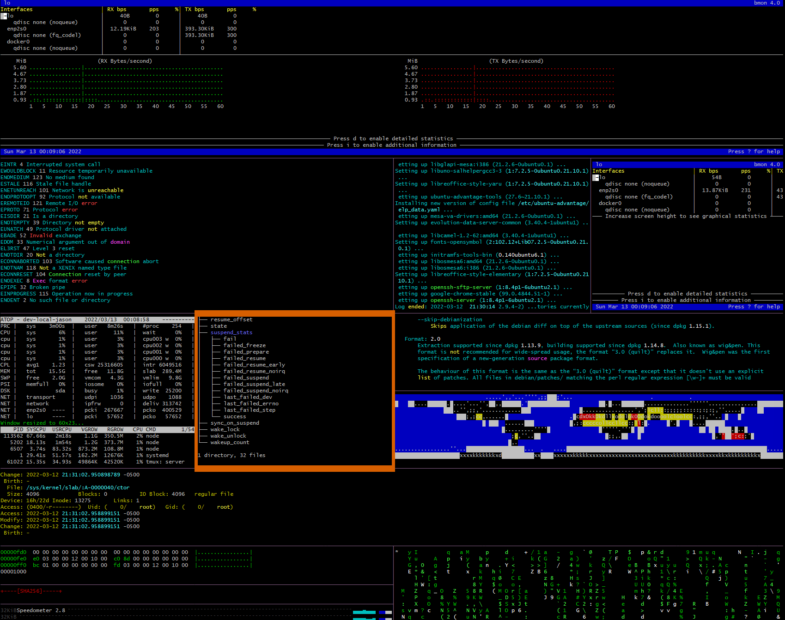
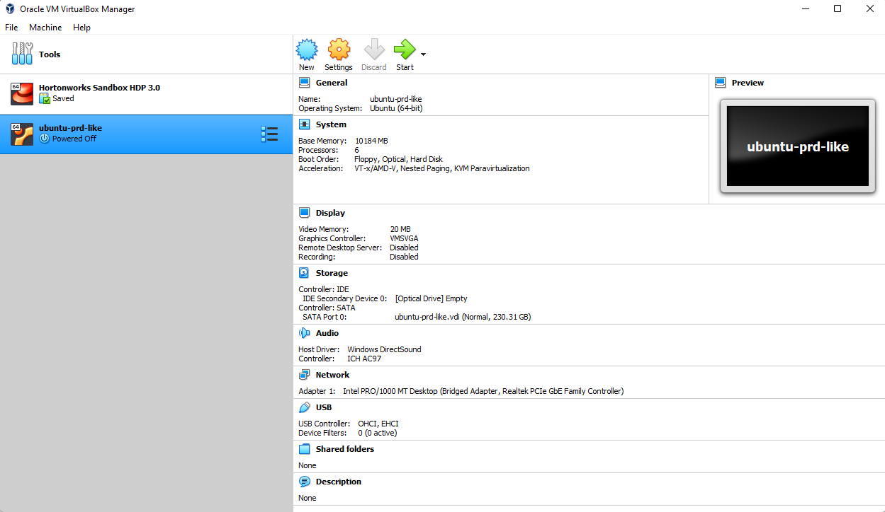
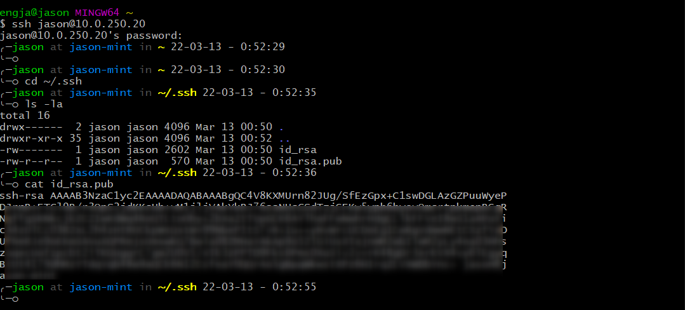
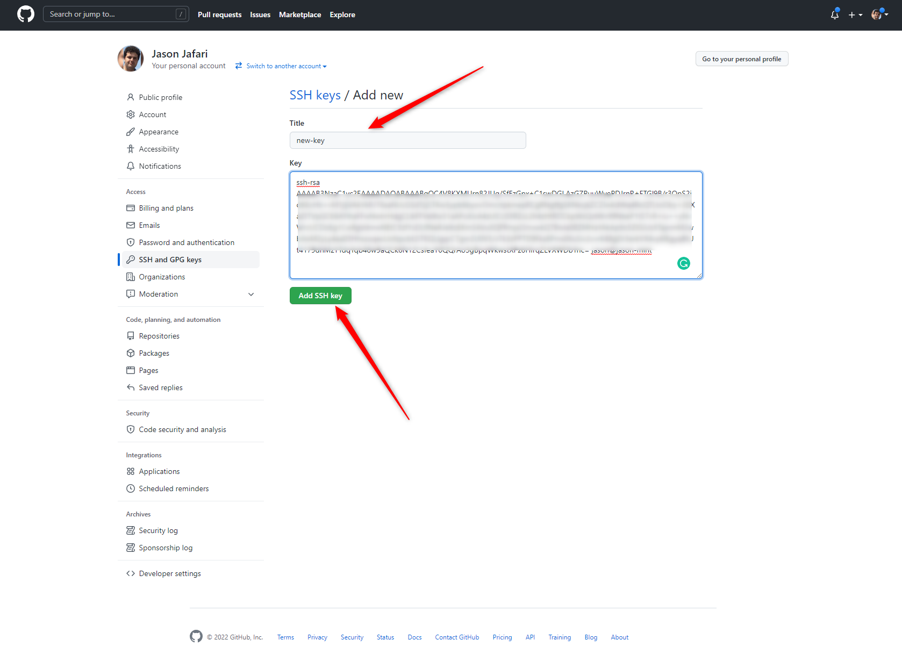
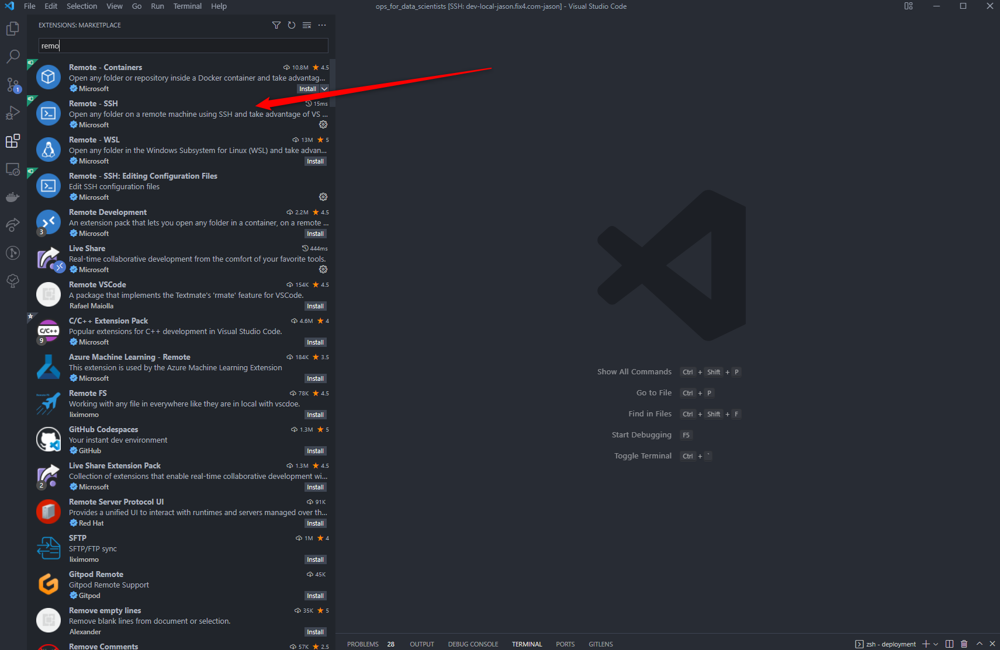
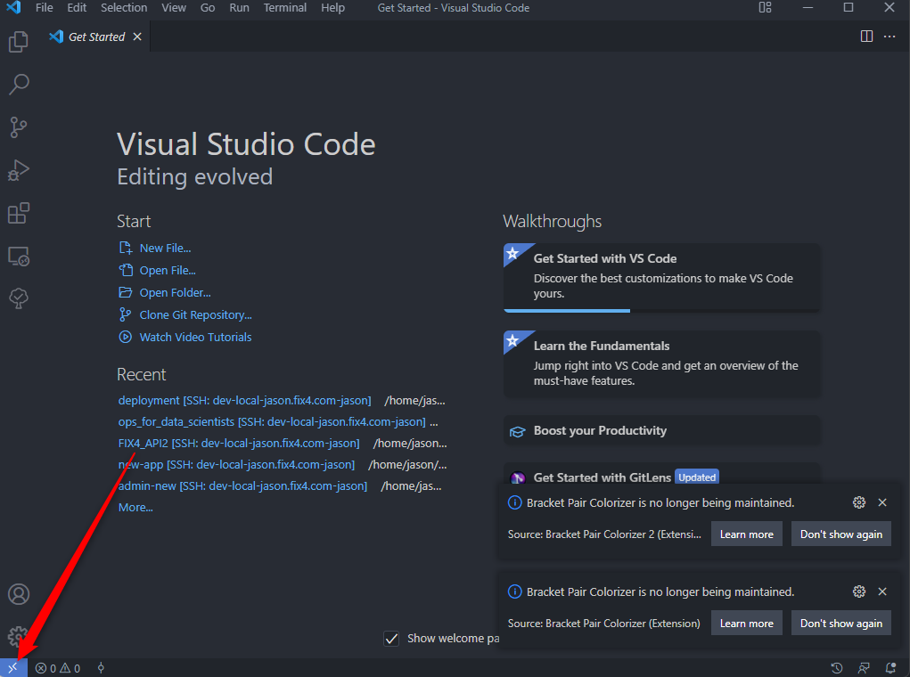
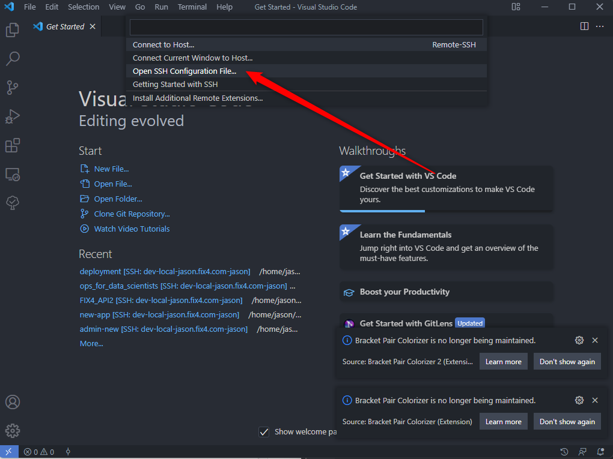
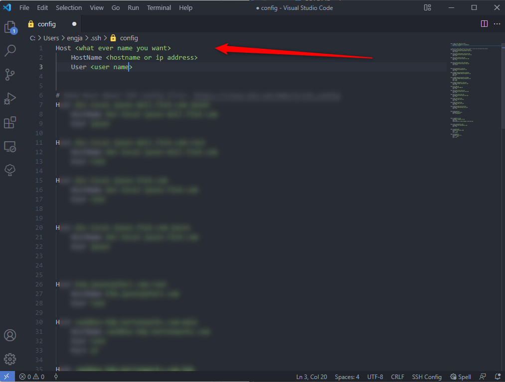
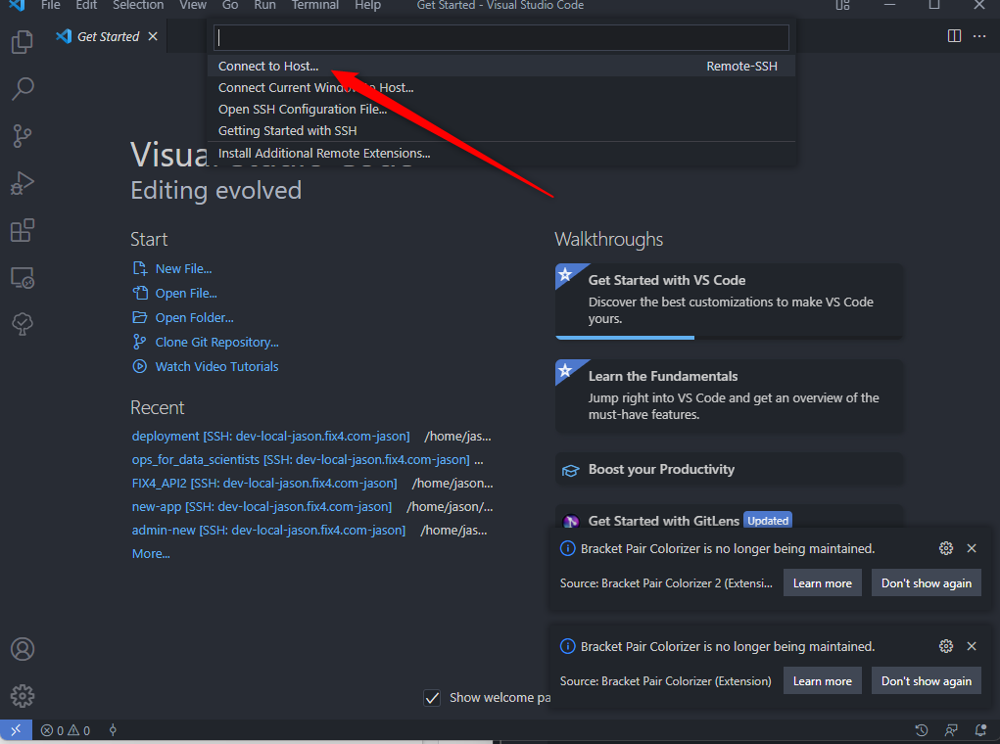

# ops_for_data_scientists
Ops for data scientists

## Sources and more readings
[https://www.gnu.org/home.en.html](https://www.gnu.org/home.en.html)

[https://dagshub.com/blog/effective-linux-bash-data-scientists/](https://dagshub.com/blog/effective-linux-bash-data-scientists/)

[https://dagshub.com/blog/setting-up-data-science-workspace-with-docker/](https://dagshub.com/blog/setting-up-data-science-workspace-with-docker/)

[https://linuxjourney.com/lesson/touch-command](https://linuxjourney.com/lesson/touch-command)

[https://www.redhat.com/en/topics/linux](https://www.redhat.com/en/topics/linux)

<br >
<br >
<br >


# How do you make the computer do what you want

<ul>
    <li>
        What is Linux?
    </li>
    <li>
        Why do people use it?
    </li>
    <li>
        What is Bash?
    </li>
    <li>
        How to use the terminal?
    </li>
    <li>
        How to exit vim?!
    </li>
</ul>

<ul>
    <li>
        Why would you use Linux, Bash, and other system tools?
    </li>
    <li>
        What's the smart way to do it, based on our subjective experience?
    </li>
    <li>
        What common problems will you come across, and how to solve them?
    </li>
    <li>
        What's the mental framework for working with these tools, to gain understanding and learn more by playing?
    </li>
</ul>

## Who is this for?

The curriculum and some of the tips are aimed at data scientists who want an introduction to the topics of Linux & Bash. However, the data science orientation mainly comes into play in a few domain specific tips, and in the stated motivations to learn these things - if you're an aspiring web developer, there's no reason not to benefit from this guide as well!
<br>

## What is GNU?
GNU is an operating system that is [free software](https://www.gnu.org/philosophy/free-sw.html) that is, it respects users' freedom. The GNU operating system consists of GNU packages (programs specifically released by the GNU Project) as well as free software released by third parties. The development of GNU made it possible to use a computer without software that would trample your freedom.
<br>
We recommend [installable versions of GNU](https://www.gnu.org/distros/free-distros.html) (more precisely, GNU/Linux distributions) which are entirely free software. [More about GNU below](https://www.gnu.org/home.en.html#More-GNU).
<br>

## What is linux?

you can find simple answer [here](https://www.redhat.com/en/topics/linux)

<ul>
    <li>
        A family of open source operating systems.
    </li>
    <li>
        Developed by <a href="https://en.wikipedia.org/wiki/Linus_Torvalds" target="_blank">Linus Torvalds</a>, who also invented Git to manage the source code for Linux.
    </li>
    <li>
        An operating system is a program that takes over a bit after your computer turns on.
    </li>
    <li>
        For the first few seconds after your computer switches on, the motherboard runs a small
    </li>
    <li>
        hard-coded operating system called the BIOS, but it quickly hands control over to some operating system kernel, which is installed on one of the hard drives, a USB stick or CD.
    </li>
    <li>
        From that point on, the kernel decides which programs to run when, and how to control physical devices (via drivers).
    </li>
    <li>
        An operating system is a bundle of programs that come packaged together. The kernel is the most important part, but it comes with more programs which help the users communicate with the kernel.
    </li>
    <li>
        e.g. File explorers are part of the OS, but not the kernel - they're just graphical interfaces which sit between the user and the kernel.
    </li>
    <li>
        Operating systems normally also handle file systems, user permissions, memory management, and many other things.
    </li>
    <li>
        The thing that unites all the different operating systems in the Linux family is they all use the same Linux kernel - other parts differ. More on that later in the section about distributions.
    </li>
</ul>
<br>

## [What is the Linux kernel?](https://www.redhat.com/en/topics/linux/what-is-the-linux-kernel)

<br>

## What is Linux good for?

<br>
An operating system is, surprisingly, just a type of system. Systems are designed by humans, and better designs lead to better performance, stability, and flexibility. Linux is simply a better designed operating system. It's super flexible and stable - "blue screens of death" are exceedingly rare in production Linux servers, and their performance is very reliable. Which is why a vast majority of production systems run on Linux, and that's also why it's good for anyone working in tech to be Linux literate. That includes you, dear reader.
<br>
<br>

Being open source leads to high quality, as bugs have fewer dark places to hide in. Developers can peer under the covers to make sure their Linux applications will work well, rather than guessing and relying on questionable documentation from closed source operating system developers.
<br>

But with great power and flexibility comes a great ability to shoot yourself in the foot. Linux makes that easy as well.

<br>

# Linux-like systems


<ul>
    <li>
        Mac and Unix are very similar to, but are not Linux technically. You will have a hard time telling the difference, unless you dive deep.
    </li>
    <li>
        Unix is older than Linux and extremely similar - In fact, Linux is an open source re-implementation of Unix (which was closed source, but very good). This is pretty much historic trivia, as Unix is rarely seen nowadays, but know that some people use the words Unix and Linux interchangeably.
    </li>
    <li>
        In general, there’s a name for operating systems that look and feel like Unix – POSIX compliant, or *nix. When you see these words, translate them as “follows the conventions of Linux, such as basic commands for file manipulation (ls, cd, mkdir) and "/" as the root of the file system etc.”
    </li>
    <li>
        GNU is a large set of free software which is the foundation for much of Linux – compilers, C libraries, programs to zip files, and many others. It's also the name of an independent POSIX operating system, with more hardcore ideology around free software than Linux.
    </li>
    <li>
        All of the above systems, as well as Linux itself, are examples of POSIX compliant or *nix systems.
    </li>
</ul>

<br>

# [Linux Distributions / Distros](https://www.redhat.com/en/topics/linux/whats-the-best-linux-distro-for-you)

<ul>
    <li>
        There are (too?) many flavours of “real Linux”, called distros or distributions. It can be a headache to differentiate them.
    </li>
    <li>
        A distribution is like a "company", which invents a new operating system. They wrap the Linux Kernel with a new bundle of peripheral programs - i.e. they may use a different mix of GUI programs, support different hardware by default, etc. They release new versions occasionally.
    </li>
    <li>
        Ubuntu. It’s the most user friendly, widely supported, and easy to install.
    </li>
    <li>
        Red Hat Enterprise Linux, or RHEL, is a different distro which is used sometimes in heavy duty production servers.
    </li>
    <li>
        Fedora is the desktop equivalent of RHEL - usually, developers aiming to run their applications on RHEL servers will use Fedora for their development computers, to avoid compatibility issues.
    </li>
    <li>
        Alpine is a super minimal distro which is used for many Docker images.
    </li>
</ul>

<br>
<br>
<br>


<br>
<br>

[source](https://upload.wikimedia.org/wikipedia/commons/1/1b/Linux_Distribution_Timeline.svg)

<br>
<br>

## Interfaces

<ul>
    <li>
        When people think of Linux, they usually associate it with a scary terminal (plus attached Anonymous hacker with a hoodie).
    </li>
    <li>
        Don't Panic – it’s not so scary! Today, it’s really easy to install Linux on a computer, with a regular GUI wizard, if you pick a distro that cares about that sort of thing (for example, Ubuntu).
    </li>
    <li>
        We'll focus on terminals / shells in this lecture, since that is always available, and generally where "real work" is done. Production servers will rarely have GUIs. Don't let that discourage you - after you get used to it, using the shell can become much more convenient than GUIs!
    </li>
</ul>

## CLI

The linux command-line offers a stable of powerful tools that can really aid in boosting productivity as well as gaining an understanding of the current state of your machine (i.e. disk-space, running processes, RAM, CPU-usage).

<br>

Working on a remote linux instance is often a great way of becoming familiar with the command-line as you are forced to use it and cannot fall back on Mac’s Finder to navigate the file-system.

## Do you want to have terminal like this --vvv-- !!! be with me you will have it



## hollywood Genact  Blessed-contrib

```
sudo apt update
sudo apt install hollywood byobu
```
```
hollywood
hollywood -s 4
hollywood -q
```

For more information [hollywood](https://github.com/dustinkirkland/hollywood), [Genact](https://github.com/svenstaro/genact), [Blessed-contrib](https://github.com/yaronn/blessed-contrib)


# Prepare environment

# For having linux environment there are options

<ul>
    <li>
        Standalone pc or lab-top have linux os on it
    </li>
    <li>
        Using virtual machines(VM) install in your pc or lab-top
    </li>
    <li>
        Having dedicate server in data-centers
    </li>
    <li>
        Having VM in data-centers
    </li>
    <li>
        Having VM in IaaS provider like AWS, GCP, Azure
    </li>
     <li>
        Having container like docker lynx and etc
    </li>
</ul>

## Install virtualbox
you can download it [here](https://www.virtualbox.org/wiki/Downloads) based on your os



## Download .iso file
In this course we want to work with ubuntu [desktop](https://ubuntu.com/download/desktop) and [server](https://ubuntu.com/download/server)


## apt or apt-get

```
sudo apt update
sudo apt upgrade
sudo apt install <package>
sudo apt remove <package>
```


# ssh

```
sudo apt install openssh-server
```
form your os terminal in case windows must installed git bash
```
ssh <username>@<ip address>
```

## firewall
```
sudo nano /etc/default/ufw
IPV6=yes
sudo ufw default deny incoming
sudo ufw default allow outgoing

sudo ufw allow OpenSSH
sudo ufw allow 22

sudo ufw show added

sudo ufw enable
```


## create password for root user
```
sudo passwd root
```

## make root user can login with ssh [#](https://www.liquidweb.com/kb/enable-root-login-via-ssh/)

```
sudo nano /etc/ssh/sshd_config
```
find PermitRootLogin in text ctrl + w and change it to
```
PermitRootLogin yes
```
ctrl + x for save and yes

```
sudo systemctl restart sshd
sudo service sshd restart
```

## reboot
```
sudo reboot
```

## generate ssh key for your user

```
cd ~/.ssh
ls -la
ssh-keygen
```
```
cd ~/.ssh
ls -la
cat id_rsa.pub
```


copy the content and add it in what ever service (in this case git hub ) you are using




if you don`t want to add password every time you can copy your os public ssh key in to your linux

```
ssh-copy-id <user name>@<ip or host name>
```


## Remote ssh with vscode
First you need already installed [visual studio code](https://code.visualstudio.com/download)
<br>
then you need to add remote ssh extension on your vs code






once you connect it you have open vscode in your linux machine and you can do what ever you want

<br>

```
cd < target folder >
code .
```


## git config

```
sudo apt install git

```

~/.gitconfig
```
[user]
	email = <your email in github>
	name = <your name>
[core]
	excludesFile = ~/.gitignore

```

~/.gitignore
```
node_modules
```


```
cd
mkdir gitHub
cd gitHub
git clone git@github.com:jafarijason/ops_for_data_scientists.git
cd ops_for_data_scientists

```


# add hostname

```
export USE_HOSTNAME=<your host name>
sudo echo $USE_HOSTNAME > /etc/hostname
sudo hostname -F /etc/hostname


```

## update and upgrade
```
sudo apt-get update
sudo apt-get upgrade -y
```

## Zsh and oh-my-zsh [#](https://ohmyz.sh/)


```
sudo apt install zsh

sh -c "$(curl -fsSL https://raw.github.com/ohmyzsh/ohmyzsh/master/tools/install.sh)"
```

~/.zshrc
```

export ZSH="$HOME/.oh-my-zsh"

ZSH_THEME="fino-time"

plugins=(
git
docker
docker-compose
rsync
aws
cp
dash
pep8
pip
pipenv
postgres
python
sudo
tmux
ubuntu
ufw
aws
)

source $ZSH/oh-my-zsh.sh

```

add zsh at the end of ~/.bashrc


## [Execute sudo without Password?](https://askubuntu.com/questions/147241/execute-sudo-without-password)


```
sudo visudo
```

```
YOUR_USERNAME_HERE ALL=(ALL) NOPASSWD: ALL
```

# remote desktop on linux only desktop

```
sudo apt -y install xrdp tigervnc-standalone-server
sudo systemctl enable xrdp
sudo systemctl start xrdp
sudo ufw allow 3389
sudo ufw reload
```


# Useful commands

## echo, date, whoami

### echo
#### [File permisions in <pos>ix Os](https://www.guru99.com/file-permissions.html)
```
man echo
echo "Hello World! "
VAR="Ops for data scientists"
echo $VAR
VAR="Test for re define variable"
echo $VAR

A=2
B=3
C=$A+$B
echo $C
C=`expr $A + $B`
echo $C
C=$(expr $A + $B)
echo $C
C=$(($A + $B))
echo $C
```

example for bash file

```
cat ./bash/sum.sh
bash ./bash/sum.sh 10 11
sh ./bash/sum.sh 10 11

chmod +x ./bash/sum.sh
./bash/sum.sh 10 11
```
example2  for bash file

```
cat ./bash/sum2.sh
bash ./bash/sum2.sh
sh ./bash/sum2.sh

chmod +x ./bash/sum2.sh
./bash/sum2.sh
```

### pwd

```
man pwd
pwd
cd .
pwd
cd ..
pwd
cd ...
pwd
cd ~
pwd
cd -
```

## whoami

```
man whoami
whoami
```

## whatis

```
whatis ls
whatis cat
whatis bash
```

## man
```
man ls
```


## touch 

```
touch <file name>
```

## cat

```
cat <file name>
```
```
cat ./data/geolocation.csv | more
more ./data/geolocation.csv
cat ./data/geolocation.csv | less
less ./data/geolocation.csv
cat ./data/geolocation.csv | head
head ./data/geolocation.csv
cat ./data/geolocation.csv | tail
tail ./data/geolocation.csv
```

## history

```
history
```

## clear

```
clear
```

## mkdir
```
mkdir books paintings
mkdir -p books/hemmingway/favorites

```

## cp, mv, rm

```
cp ./imgs/distro-family-tree.png /tmp
mkdir -p /tmp/test
cp ./imgs/*.png /tmp/test
cp -r imgs /tmp/test/imgs-copy
cp -R imgs /tmp/test/imgs-copy


mv /tmp/distro-family-tree.png /tmp/distro-family-tree2.png


rm file1
rm -f file1
rm -i file
rm -r directory


rm -rf /tmp/test
```

## ls 
```
ls 
ls -la
ls -hlS
ls -lha
```

## uname
```
uname
uname --help
uname -a
```

## lsb_release 
```
lsb_release 
lsb_release  --help
```


## watch
```
watch ls -la 

watch ls -la  -3

```


## ps

```
ps
ps -a
```


## top

```
top
```
## htop

```
htop
```

## btop

```
# sudo snap install btop
btop
```

## mc
```
mc
```

## kill
```
kill -9 PID

```


## nc 
```
nc -zv 10.0.250.2 22-500
nc -zv 127.0.0.1 20-100
```


<br>
<br>
<br>
<br>
<br>
<br>
<br>


## install docker

```
sudo apt-get install \
    ca-certificates \
    curl \
    gnupg \
    lsb-release

curl -fsSL https://download.docker.com/linux/ubuntu/gpg | sudo gpg --dearmor -o /usr/share/keyrings/docker-archive-keyring.gpg
echo \
  "deb [arch=$(dpkg --print-architecture) signed-by=/usr/share/keyrings/docker-archive-keyring.gpg] https://download.docker.com/linux/ubuntu \
  $(lsb_release -cs) stable" | sudo tee /etc/apt/sources.list.d/docker.list > /dev/null

sudo apt-get update
sudo apt-get install -y docker-ce docker-ce-cli containerd.io

```

## install docker compose
```
sudo curl -L "https://github.com/docker/compose/releases/download/1.29.2/docker-compose-$(uname -s)-$(uname -m)" -o /usr/local/bin/docker-compose

sudo chmod +x /usr/local/bin/docker-compose
sudo ln -s /usr/local/bin/docker-compose /usr/bin/docker-compose
docker-compose --version

```